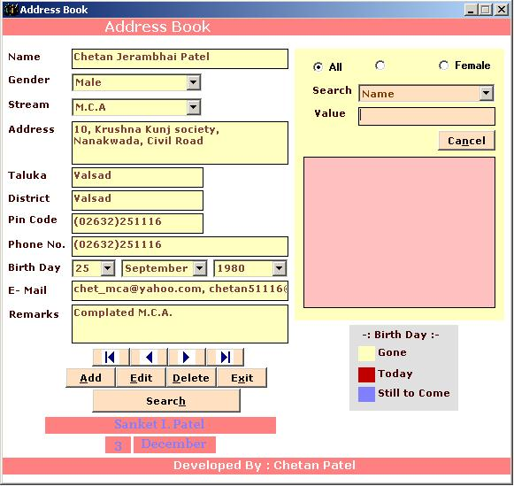



## Simple And Clear Address Book With Reminder \-Yew Technologies

### Description

This is very simple address book keeping data for your nearest one and also getting alerts for the reminders of the birthdays.Please Vote for me if you think I did good job.
 
### More Info
 

             |
---                |---
**Submitted On**   |2006-11-17 18:16:16
**By**             |[Yew Technologies](https://github.com/Planet-Source-Code/PSCIndex/blob/master/ByAuthor/yew-technologies.md)
**Level**          |Beginner
**User Rating**    |5.0 (10 globes from 2 users)
**Compatibility**  |VB 6\.0, VBA MS Access
**Category**       |[Databases/ Data Access/ DAO/ ADO](https://github.com/Planet-Source-Code/PSCIndex/blob/master/ByCategory/databases-data-access-dao-ado__1-6.md)
**World**          |[Visual Basic](https://github.com/Planet-Source-Code/PSCIndex/blob/master/ByWorld/visual-basic.md)
**Archive File**   |[Simple\_And2035541252006\.zip](https://github.com/Planet-Source-Code/yew-technologies-simple-and-clear-address-book-with-reminder-yew-technologies__1-67292/archive/master.zip)

